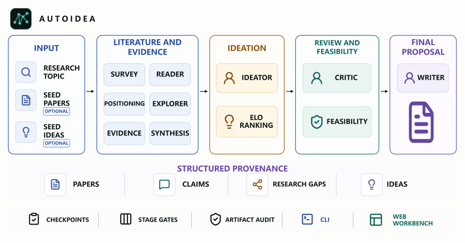
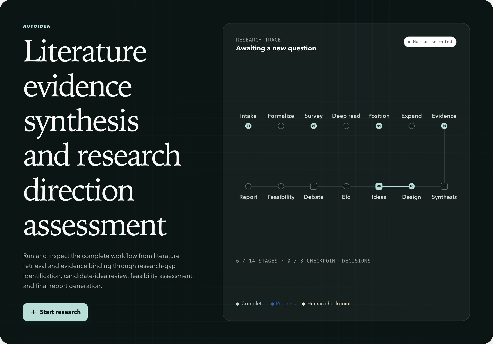
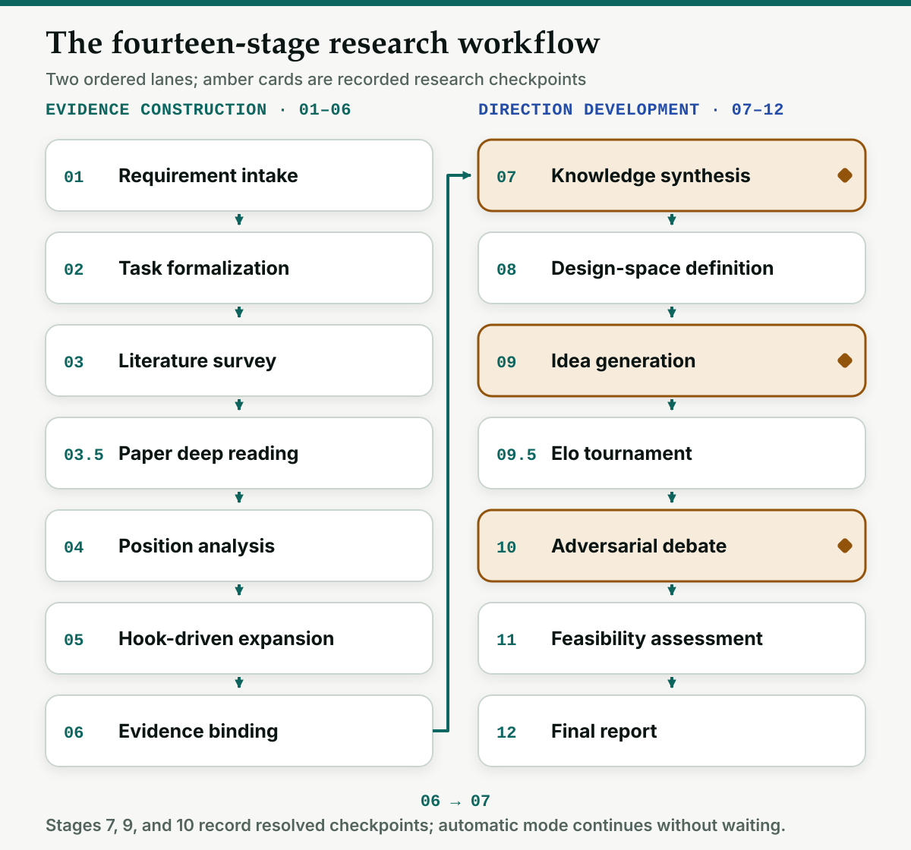
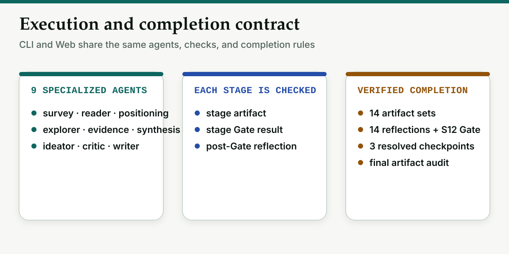
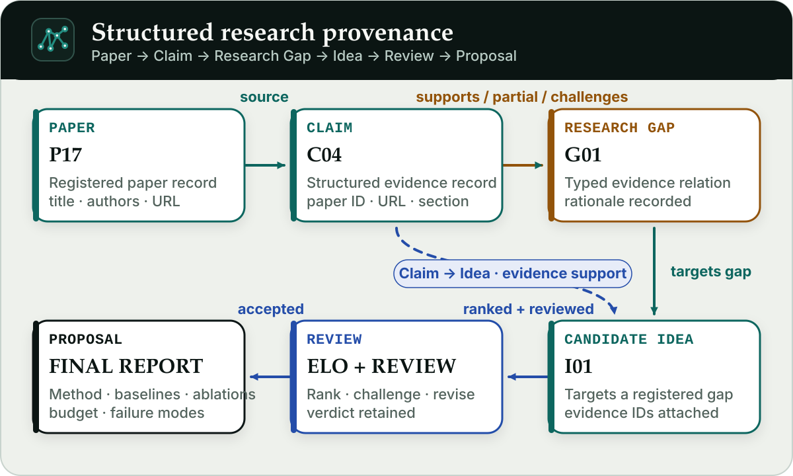
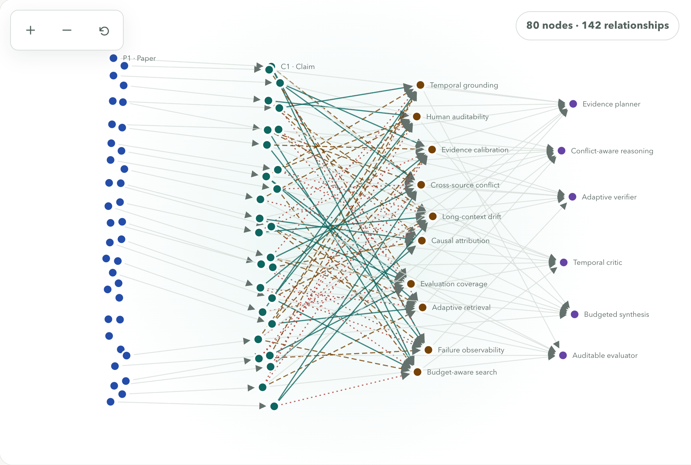

<p align="center">
  <a href="README.md"><strong>English</strong></a> ·
  <a href="README_CN.md">简体中文</a>
</p>

<h1 align="center"> AutoIdea</h1>

<p align="center"><strong>Literature evidence synthesis and research direction assessment</strong></p>

<picture>
  
</picture>

AutoResearch systems have made rapid progress on procedural work such as
implementing methods, orchestrating experiments, and iterating code against
measurable feedback. Forming a defensible research idea, however, is not merely
another procedural step: it requires broad literature coverage, source-level
evidence, explicit gap identification, and systematic comparison with adjacent
work. One-shot ideation from a bounded model context often leaves these
requirements implicit, making novelty, feasibility, and the actual research gap
difficult to assess before costly implementation begins.

AutoIdea treats scientific ideation as an evidence-grounded multi-agent research
process. Given a research topic—and, optionally, seed papers or preliminary
ideas—it builds and filters a literature set, reads selected papers, records
source-backed Claims, derives research gaps through explicit Claim-to-Gap links,
and generates and ranks multiple candidate directions. Adversarial review and
feasibility analysis then refine the strongest directions into a research
proposal. The resulting proposal is accompanied by an inspectable chain from
papers and evidence to gaps, research decisions, and an executable study plan.

<p align="center">
  <a href="#quick-start">Quick start</a> ·
  <a href="#research-workflow">Workflow</a> ·
  <a href="#structured-provenance">Provenance</a> ·
  <a href="#execution-modes">Execution modes</a> ·
  <a href="#configuration">Configuration</a> ·
  <a href="#scope-and-limitations">Limitations</a>
</p>

## What the system does

| Layer | What is recorded |
| --- | --- |
| Literature | A ranked, deduplicated paper registry assembled from academic search sources, followed by full-text reading where available and a recorded abstract-only fallback. |
| Evidence | Stable paper and Claim IDs, source URLs, sections, evidence types, confidence, and structural cross-file checks. |
| Research gaps | Stable Gap IDs plus typed Claim-to-Gap links with a rationale for each relationship. |
| Candidate directions | A design space, evidence-linked ideas, pairwise Elo rankings, adversarial reviews, and feasibility assessments. |
| Completion proof | Required artifacts, stage-gate results, post-gate reflections, checkpoint decisions, and a final artifact audit. |

Nine specialized agents divide this work across survey, reading, positioning,
literature expansion, evidence extraction, synthesis, ideation, criticism, and
writing. Large search, reading, and evidence tasks use file-backed batches so
the main agent does not need to retain every raw result in its prompt context.

## Quick start

From the root of an already cloned or downloaded copy of the repository:

```bash
python3 --version  # requires 3.11, 3.12, or 3.13
python3 -m venv .venv
source .venv/bin/activate
python -m pip install --upgrade pip setuptools
python -m pip install -e ".[web]"
autoidea web --workspace examples/sample_workspace --port 8765
```

Open <http://127.0.0.1:8765> if the browser does not open automatically. Use
`--no-open` on a remote terminal. If port 8765 is occupied, choose another one,
for example `--port 8766`.

<details>
<summary>Windows PowerShell</summary>

```powershell
py -3.13 -m venv .venv
.venv\Scripts\Activate.ps1
python -m pip install --upgrade pip setuptools
python -m pip install -e ".[web]"
autoidea web --workspace examples/sample_workspace --port 8765
```

</details>

<picture>
  <source media="(max-width: 600px)" srcset="assets/screenshots/dashboard-overview-en-mobile.png" />
  
</picture>

> The bundled sample contains 2 papers, 2 Claims, 3 research gaps, 1 idea, and
> 9 artifacts for exploring the interface and structured outputs.

## Demo

https://github.com/user-attachments/assets/67c1436f-c954-4436-9154-8e4cc2b107b1

## Run a real study

Real runs contact the configured model and literature services and may incur
provider charges. Review the saved settings, per-run limits, and credentials
before starting.

```bash
cp .env.example .env
```

Use `.env` for the credentials and service endpoints you need:

```dotenv
OPENAI_API_KEY=your-key
```

Choose ordinary provider and model defaults in Web Settings or with the CLI.
The built-in defaults are `openai` and `gpt-5.6-sol`:

```bash
autoidea config set provider openai
autoidea config set model gpt-5.6-sol
```

Check that the required values and optional provider package are present:

```bash
autoidea doctor
```

Start a fully automatic CLI run:

```bash
autoidea \
  --prompt "Assess research directions for reliable multimodal reasoning" \
  --workdir ./workspace/first-run
```

Or start the local workbench against a workspace root, then create a run in the
browser:

```bash
autoidea web --workspace ./workspace --port 8765
```

You can also start an interactive terminal with
`autoidea --workdir ./workspace/first-run`, leave with `/exit`, and resume a
saved conversation with `autoidea --thread-id <id>`.

Optional seed material can constrain the search and ideation process:

```bash
autoidea \
  --seed-papers examples/seed_papers_example.json \
  --seed-ideas examples/seed_ideas_example.md \
  --workdir ./workspace/seeded-run
```

## Research workflow

<picture>
  <source media="(max-width: 600px)" srcset="assets/diagrams/autoidea-workflow-en-mobile.svg" />
  
</picture>

<picture>
  <source media="(max-width: 600px)" srcset="assets/diagrams/autoidea-workflow-contract-en-mobile.svg" />
  
</picture>

The required workflow contains 14 stage entries. Stage 0.5 is optional and runs
only when seed-idea material is supplied; it is not counted in the 14-stage
completion contract.

| Stage | Operation | Canonical output |
| --- | --- | --- |
| 1 | Requirement intake | `research_brief.md` |
| 2 | Task formalization | `task_formalization.md` |
| 3 | Literature survey | `literature_survey.md`, `paper_registry.json` |
| 3.5 | Paper deep reading | `paper_deep_reading.md` |
| 4 | Position-first analysis | `paper_positions.json` |
| 5 | Hook-driven expansion | `expanded_literature.md` |
| 6 | Evidence binding | `evidence_db.json` |
| 7 | Knowledge synthesis | `knowledge_synthesis.md`, `research_gaps.json` |
| 8 | Design-space definition | `design_space.json` |
| 9 | Idea generation | `raw_ideas.json` |
| 9.5 | Elo tournament | `tournament_rankings.json` |
| 10 | Adversarial debate | `debate_log.md`, `idea_reviews.json` |
| 11 | Feasibility assessment | `feasibility_assessments.json` |
| 12 | Final report | `final_report.md` |

Literature discovery tools cover Semantic Scholar, arXiv, OpenAlex, DBLP,
Crossref, PubMed, and CVF. Tavily is optional for broader Web retrieval.

At Stage 3, scholarly search and lookup tools record discovered papers in
`session_paper_registry.json`; file-backed search batches are then merged into
the canonical `paper_registry.json` and `literature_survey.md`. The merger
checks the batch structure and deduplicates records, but it does not independently
prove every model-supplied bibliographic field against the session registry.
Stage 3.5 attempts full-text reading for selected papers and records an
abstract-only fallback when full text cannot be obtained.

Stage 5 asks the explorer agent to broaden the survey from identified
weaknesses and write `expanded_literature.md`. Registry-bounded selection and
the diminishing-returns stop record are workflow instructions rather than a
separate source-enforcing artifact writer.

At Stage 6, `evidence_db.json` records Claim IDs and available paper, URL,
section, evidence-type, and confidence fields. `cite_source` and citation
middleware provide lightweight identity and formatting checks when used; the current audit
does not claim semantic entailment, require a supporting passage or overlap
score, or re-hash every local full-text file. Review important Claims against
their cited papers before relying on them.

## Structured provenance

AutoIdea persists relationships rather than reconstructing them from prose:

```text
Paper → Claim → Research Gap → Idea
          └────────────────────→ Idea
```

<picture>
  <source media="(max-width: 600px)" srcset="assets/diagrams/autoidea-hero-en-mobile.svg" />
  
</picture>

- `paper_registry.json` assigns stable `P<number>` IDs.
- `evidence_db.json` assigns stable `C<number>` Claim IDs and records source
  metadata.
- `research_gaps.json` assigns stable `G<number>` IDs. Every Claim-to-Gap edge
  has one of three relationship types—`supports`, `partial_coverage`, or
  `challenges`—plus a gap-specific rationale.
- `raw_ideas.json` links candidate ideas to registered gaps and supporting
  evidence.

The `research_gaps.json` writer and audit validate Claim-to-Gap IDs and the
three supported relationship types; the browser renders these structured
relationships instead of inferring them from Markdown. Idea-side supporting
references are rendered as stored and should also be reviewed against the
evidence and gap registries.

As a study accumulates sources, the same structure expands into a dense evidence
topology while preserving the type and direction of each relationship. The
documentation view below uses synthetic data—36 papers, 28 Claims, 10 research
gaps, 6 ideas, and 142 relationships—to demonstrate that scale; it does not
represent the output of a real run.

<picture>
  <source media="(max-width: 600px)" srcset="assets/screenshots/dashboard-literature-map-en-mobile.png" />
  
</picture>

The graph uses color, labels, line styles, an inspector, and an accompanying
relationship table; color is not the sole carrier of relationship meaning.

## Execution modes

Fully automatic execution is the default in both CLI and Web. Stage 7, Stage 9,
and Stage 10 still produce requested-and-resolved checkpoint records, but the
system approves them immediately and does not wait for a person.

The runtime also uses DeepAgents' model-aware automatic summarization and
compaction for long contexts, including overflow recovery and backend offload.
Its effective token threshold depends on the selected model profile rather than
a fixed project-wide token or message count.

Use manual checkpoints when you want to review those stages:

```bash
autoidea \
  --manual-checkpoints \
  --prompt "Assess research directions for reliable multimodal reasoning" \
  --workdir ./workspace/manual-review
```

At a manual checkpoint, the reviewer can approve, request a revision, request a
rerun, or choose **Skip review · continue automatically**. The last option
resolves the current checkpoint, persists automatic mode for that run, and
prevents the remaining research checkpoints from pausing. `--auto-approve`
remains available as an explicit compatibility flag for fully automatic runs.

Automatic mode changes who resolves a checkpoint; it does not bypass artifact
validation or remove checkpoint provenance.

## Completion is verified from artifacts

A normal model response—or a child process exiting with code 0—is not enough to
declare a Web-managed run verified. The current completion view requires:

- all 14 stage artifact sets to exist and pass the implemented readiness and
  cross-file checks;
- all 14 stage reflections to be present, including persisted Gate proof for
  Stage 12;
- Stage 7, Stage 9, and Stage 10 each to have a resolved checkpoint record;
- `final_report.md` to exist; and
- the final artifact audit to pass without errors.

During one process, a reflection can be saved only after its stage Gate passes.
To avoid an infinite loop, a stage Gate reports a warning and force-continues
after five consecutive failures; that continuation is not by itself proof that
the final workspace is valid. The Pipeline view exposes the final artifact and
audit conditions separately. The synthetic sample is therefore shown as
incomplete even though it contains enough files to demonstrate the workbench.

## Specialized agents

| Agents | Responsibility |
| --- | --- |
| `survey`, `reader`, `positioning`, `explorer` | Decompose the question, search across sources, read selected papers, critique positions, and expand from identified weaknesses. |
| `evidence`, `synthesis` | Bind claims to sources, synthesize the corpus, score gaps, and write the structured Claim-to-Gap registry. |
| `ideator` | Define the design space, generate evidence-linked directions, and run pairwise Elo ranking. |
| `critic`, `writer` | Challenge novelty, feasibility, soundness, and evaluation; revise and assemble the final proposal with provenance. |

## Configuration

Configuration precedence is:

```text
Web/CLI per-run options > environment or .env > user config file > built-in defaults
```

| Provider saved in Settings/config | Credential or endpoint in `.env` | Optional extra |
| --- | --- | --- |
| `openai` | `OPENAI_API_KEY` | none |
| `anthropic` | `ANTHROPIC_API_KEY` | none |
| `google-genai` | `GOOGLE_API_KEY` | `.[web,google]` |
| `ollama` | `OLLAMA_BASE_URL` | `.[web,ollama]` |
| `custom-openai` | `CUSTOM_OPENAI_API_KEY`, `CUSTOM_OPENAI_BASE_URL` | none |
| `custom-anthropic` | `CUSTOM_ANTHROPIC_API_KEY`, `CUSTOM_ANTHROPIC_BASE_URL` | none |

Set `model` in Web Settings or with `autoidea config set model <name>` to a
model exposed by the selected provider. An API-shaped compatible endpoint is
not automatically guaranteed to support every model or feature; validate it
with your provider.

Transient model failures are retried automatically. Ordinary failures use the
short generic backoff; HTTP 429 responses use a separate 30-second default so a
token-per-minute window can recover, while a longer provider `Retry-After`
value takes precedence. Tune these behaviors with
`AUTOIDEA_MODEL_RETRY_ATTEMPTS`, `AUTOIDEA_MODEL_RETRY_BACKOFF_S`, and
`AUTOIDEA_MODEL_RATE_LIMIT_BACKOFF_S`.

Keep secrets and custom service base URLs in the ignored `.env` file. Keep
ordinary defaults such as provider, model, and pipeline limits in the user
configuration edited through Web Settings or `autoidea config set`; use Web
new-run fields or CLI options for a one-run override.

`config.yaml` is not stored in the repository. It is created when a setting is
first saved and normally lives at `~/.config/autoidea/config.yaml`. The commands
below show the exact path and the saved and effective values:

```bash
autoidea config path
autoidea config list
autoidea config get provider
autoidea config get auto_approve
```

Do not define the same ordinary setting in both `.env` and the user config.
Environment values act as deployment-wide overrides and take precedence over
saved defaults; a per-run Web or CLI value takes precedence over both. Never
commit provider keys, private prompts, local workspaces, session databases, or
run logs.

## Web workbench

The browser exposes Overview, Live run, Final report, Literature map, Papers,
Evidence, Ideas, Pipeline, Artifacts, and Settings. It can inspect an existing
workspace without credentials; starting or resuming a real run uses the
selected provider configuration.

The server is intentionally a local, single-user tool. Keep the default
`127.0.0.1` binding. It does not provide the authentication, authorization,
TLS, quotas, or tenant isolation required for a public deployment. See
[the Web workbench guide](docs/web-dashboard.md) and
[the security policy](SECURITY.md) before exposing it to any network.

## Scope and limitations

- AutoIdea checks provenance structure, required fields, IDs, stage order, and
  completion evidence. These checks do not prove scientific correctness,
  novelty, experimental validity, or publication readiness.
- Literature coverage depends on provider availability, rate limits, query
  design, accessible metadata, and obtainable full text.
- Model and search calls can fail, be rate-limited, or incur usage charges.
- Retrieved papers and text may be incomplete, inconsistent, or incorrectly
  attributed. Review generated artifacts and citations before using or sharing
  them.
- The bundled sample is synthetic and partial; it demonstrates the interface
  rather than serving as an evaluation suite.

## Contributing, security, and license

Contributions should include tests for changed behavior and documentation for
changes to CLI options, configuration, artifacts, or Web behavior. Read
[CONTRIBUTING.md](CONTRIBUTING.md) before opening a change.

Report security issues privately as described in
[SECURITY.md](SECURITY.md). AutoIdea is licensed under
[Apache License 2.0](LICENSE).
