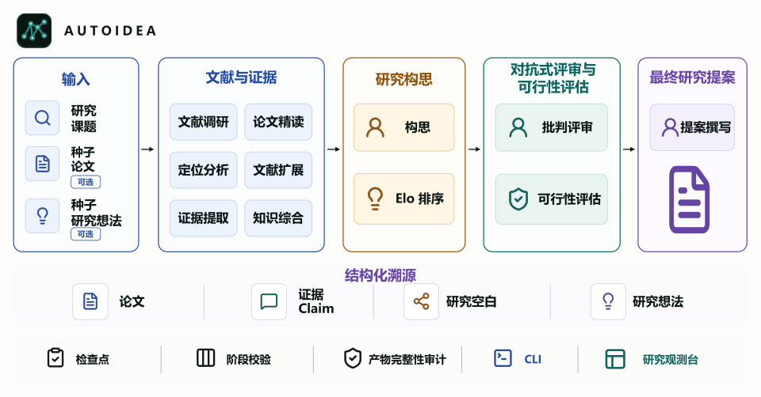
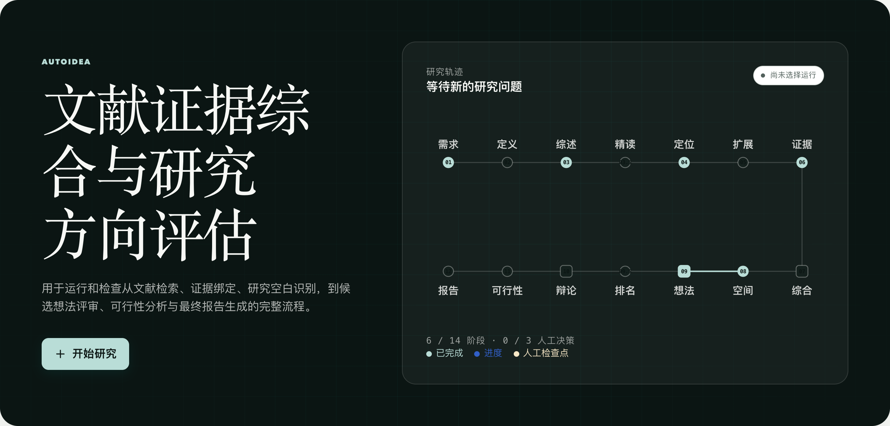
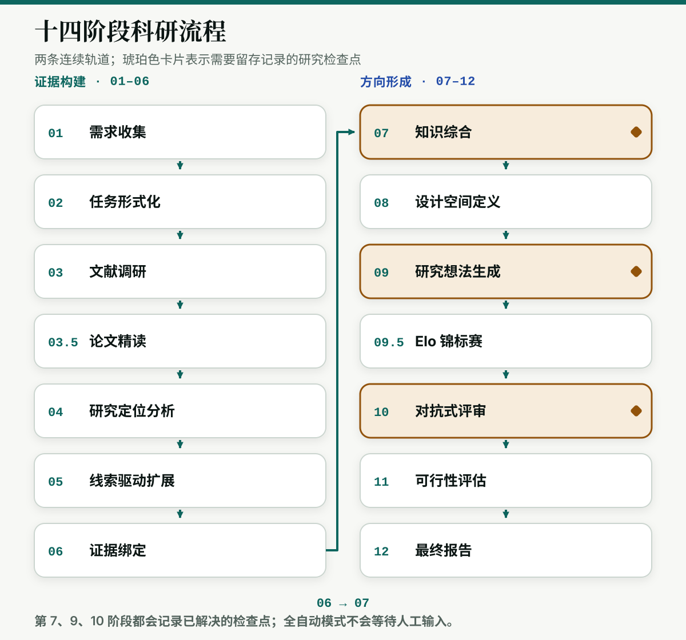
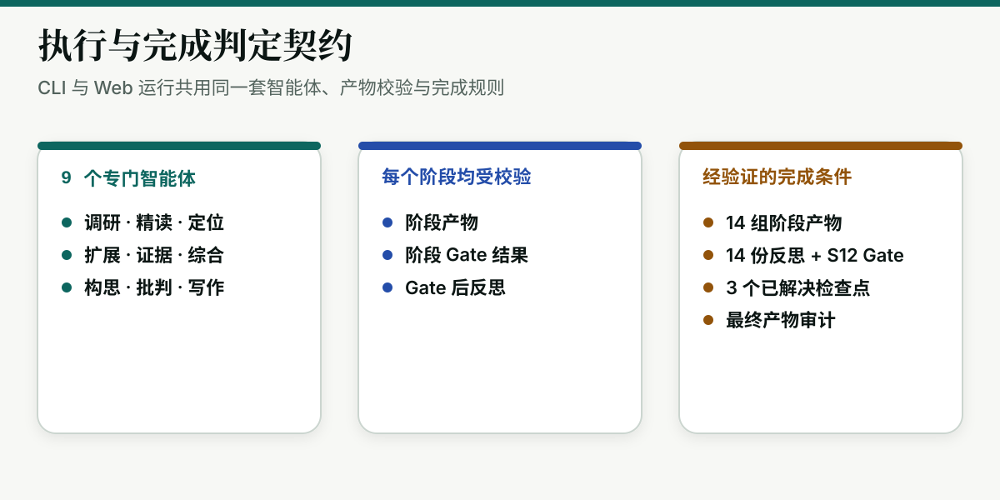
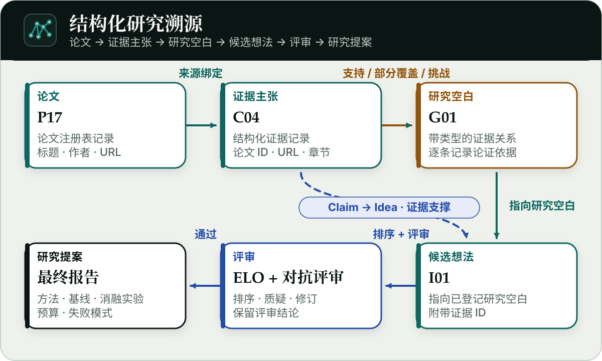
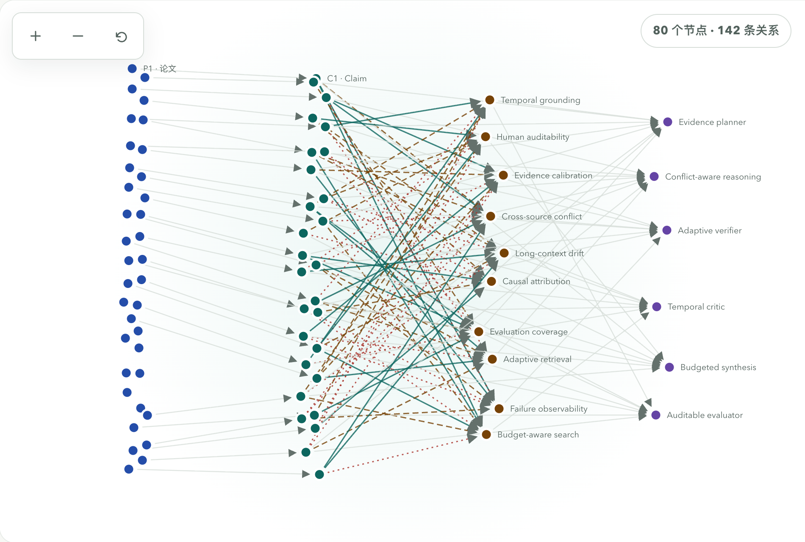

<p align="center">
  <a href="README.md">English</a> ·
  <a href="README_CN.md"><strong>简体中文</strong></a>
</p>

<h1 align="center"> AutoIdea</h1>

<p align="center"><strong>文献证据综合与研究方向评估</strong></p>

<picture>
  
</picture>

AutoResearch 系统正在快速提升对流程化工作的执行能力，例如实现方法、组织实验，以及依据可量化反馈迭代代码。然而，形成一个可辩护的研究构想并非另一个简单的流程步骤：它需要足够广的文献覆盖、可定位到来源的证据、明确的研究空白，以及与邻近工作的系统比较。仅依赖有限上下文的一次性构思，往往无法同时满足这些要求，导致研究者在投入高成本的实现与实验之前，难以检验方向的新颖性、可行性及其真正要解决的研究空白。

AutoIdea 将科学研究构想组织为证据驱动的多智能体研究过程。输入研究课题，并可选提供种子论文或初步想法后，系统会建立并筛选文献集合、精读入选论文、记录来源可追踪的 Claim，通过显式的 Claim-to-Gap 关系提炼研究空白，并生成、排序多个候选方向。随后，对抗式评审与可行性分析会持续检验和细化较强的方向，最终形成研究提案。产物不仅包含候选想法，还保留一条从论文和证据到研究空白、研究决策与可执行研究方案的可检查链条。

<p align="center">
  <a href="#快速开始">快速开始</a> ·
  <a href="#科研流程">科研流程</a> ·
  <a href="#结构化溯源">结构化溯源</a> ·
  <a href="#执行模式">执行模式</a> ·
  <a href="#配置">配置</a> ·
  <a href="#能力边界">能力边界</a>
</p>

## 系统完成什么工作

| 层次 | 记录内容 |
| --- | --- |
| 文献 | 从多个学术检索源形成经排序、去重的论文注册表；可获时进行全文精读，否则明确记录仅摘要回退。 |
| 证据 | 稳定的论文与 Claim ID、来源 URL、章节、证据类型、置信度及结构性跨文件检查。 |
| 研究空白 | 稳定的 Gap ID，以及每条带关系类型和论证依据的 Claim-to-Gap 映射。 |
| 候选方向 | 设计空间、关联证据的研究想法、Elo 两两排序、对抗式评审和可行性评估。 |
| 完成证明 | 必需产物、阶段 Gate 结果、Gate 后反思、检查点决策和最终产物审计。 |

九个专门智能体分别负责调研、精读、定位分析、文献扩展、证据提取、知识综合、构思、批判与写作。大规模检索、精读和证据任务采用文件式批处理，主 Agent 不需要把所有原始结果始终保留在提示词上下文中。

## 快速开始

在已经 clone 或下载好的仓库根目录执行：

```bash
python3 --version  # 需要 3.11、3.12 或 3.13
python3 -m venv .venv
source .venv/bin/activate
python -m pip install --upgrade pip setuptools
python -m pip install -e ".[web]"
autoidea web --workspace examples/sample_workspace --port 8765
```

如果浏览器没有自动打开，请访问 <http://127.0.0.1:8765>。远程终端中可添加 `--no-open`；如果 8765 端口已占用，可改用 `--port 8766`。

<details>
<summary>Windows PowerShell</summary>

```powershell
py -3.13 -m venv .venv
.venv\Scripts\Activate.ps1
python -m pip install --upgrade pip setuptools
python -m pip install -e ".[web]"
autoidea web --workspace examples/sample_workspace --port 8765
```

</details>

<picture>
  <source media="(max-width: 600px)" srcset="assets/screenshots/dashboard-overview-zh-mobile.png" />
  
</picture>

> 内置示例包含 2 篇论文、2 条 Claim、3 个研究空白、1 个想法和 9 份产物，用于查看界面和结构化产物。

## 产品演示

https://github.com/user-attachments/assets/0f1183ef-9ff4-458c-92a5-807815884956

## 运行真实研究任务

真实运行会访问所配置的模型与文献服务，并可能产生供应商费用。开始前请检查已保存配置、本次任务限制和凭据。

```bash
cp .env.example .env
```

在 `.env` 中只填写所需的密钥和服务地址：

```dotenv
OPENAI_API_KEY=your-key
```

通过 Web 设置或 CLI 选择普通的提供方和模型默认值。内置默认为 `openai` 和 `gpt-5.6-sol`：

```bash
autoidea config set provider openai
autoidea config set model gpt-5.6-sol
```

先检查必需配置和可选提供方依赖是否齐全：

```bash
autoidea doctor
```

启动一次默认的全自动 CLI 任务：

```bash
autoidea \
  --prompt "评估可靠多模态推理的研究方向" \
  --workdir ./workspace/first-run
```

也可以让本地工作台管理一个工作区，再从浏览器创建任务：

```bash
autoidea web --workspace ./workspace --port 8765
```

使用 `autoidea --workdir ./workspace/first-run` 可进入交互式终端；输入 `/exit` 退出，使用 `autoidea --thread-id <id>` 恢复已保存的会话。

还可以用种子材料约束检索与构思过程：

```bash
autoidea \
  --seed-papers examples/seed_papers_example.json \
  --seed-ideas examples/seed_ideas_example.md \
  --workdir ./workspace/seeded-run
```

## 科研流程

<picture>
  <source media="(max-width: 600px)" srcset="assets/diagrams/autoidea-workflow-zh-mobile.svg" />
  
</picture>

<picture>
  <source media="(max-width: 600px)" srcset="assets/diagrams/autoidea-workflow-contract-zh-mobile.svg" />
  
</picture>

必需流程共有 14 个阶段条目。只有提供种子想法时才会先执行可选的 Stage 0.5；它不计入 14 阶段完成契约。

| 阶段 | 操作 | 规范产物 |
| --- | --- | --- |
| 1 | 需求收集 | `research_brief.md` |
| 2 | 任务形式化 | `task_formalization.md` |
| 3 | 文献调研 | `literature_survey.md`、`paper_registry.json` |
| 3.5 | 论文精读 | `paper_deep_reading.md` |
| 4 | 研究定位分析 | `paper_positions.json` |
| 5 | 线索驱动扩展 | `expanded_literature.md` |
| 6 | 证据绑定 | `evidence_db.json` |
| 7 | 知识综合 | `knowledge_synthesis.md`、`research_gaps.json` |
| 8 | 设计空间定义 | `design_space.json` |
| 9 | 研究想法生成 | `raw_ideas.json` |
| 9.5 | Elo 锦标赛 | `tournament_rankings.json` |
| 10 | 对抗式评审 | `debate_log.md`、`idea_reviews.json` |
| 11 | 可行性评估 | `feasibility_assessments.json` |
| 12 | 最终报告 | `final_report.md` |

文献发现工具覆盖 Semantic Scholar、arXiv、OpenAlex、DBLP、Crossref、PubMed 和 CVF；Tavily 可选，用于更广泛的 Web 检索。

Stage 3 中，学术搜索和论文查询工具会把已发现论文记录到 `session_paper_registry.json`，随后把文件式检索批次合并为规范的 `paper_registry.json` 和 `literature_survey.md`。合并器会检查批次结构并去重，但不会把每个模型填写的书目字段都与会话注册表独立核实。Stage 3.5 会尝试精读入选论文全文；无法取得全文时，明确记录仅摘要回退。

Stage 5 由 explorer Agent 沿已识别的研究弱点扩展调研，并写入 `expanded_literature.md`。受注册表约束的选择和低收益停止记录属于流程指令，当前不是由独立的来源强制写入器保证。

Stage 6 的 `evidence_db.json` 记录 Claim ID 以及可获的论文、URL、章节、证据类型和置信度字段。`cite_source` 和引用中间件在被使用时提供轻量身份与格式检查；当前审计不宣称完成语义蕴含验证，也不强制每条 Claim 保存支撑段落、重合度分数或重新核验全文哈希。依赖重要 Claim 前应回到引用论文人工复核。

## 结构化溯源

AutoIdea 会持久化关系，而不是事后从正文猜测连接：

```text
论文 → Claim → Research Gap → 想法
          └──────────────────→ 想法
```

<picture>
  <source media="(max-width: 600px)" srcset="assets/diagrams/autoidea-hero-zh-mobile.svg" />
  
</picture>

- `paper_registry.json` 分配稳定的 `P<number>` 论文 ID；
- `evidence_db.json` 分配稳定的 `C<number>` Claim ID 并记录来源元数据；
- `research_gaps.json` 分配稳定的 `G<number>` Gap ID。每条 Claim-to-Gap 边都必须带有 `supports`、`partial_coverage` 或 `challenges` 中的一种关系类型，以及针对该 Gap 的论证依据；
- `raw_ideas.json` 把候选想法连接到已登记的 Gap 和支撑证据。

`research_gaps.json` 写入器和审计会校验 Claim-to-Gap ID 以及三种支持的关系类型；浏览器会渲染这些结构化关系，而不是从 Markdown 猜测 Claim-to-Gap 连线。想法侧的支撑引用会按产物中的记录显示，仍应对照证据库和 Gap 注册表复核。

随着论文、证据、研究空白和候选方向持续积累，同一结构会扩展为高密度证据网络，同时保留每条关系的类型与方向。下方文档截图使用 36 篇论文、28 条 Claim、10 个研究空白、6 个想法和 142 条关系的合成数据展示这一规模，不代表某次真实运行的产物。

<picture>
  <source media="(max-width: 600px)" srcset="assets/screenshots/dashboard-literature-map-zh-mobile.png" />
  
</picture>

图谱同时使用颜色、标签和线型，并提供节点检查器及关系表；关系含义不只依赖颜色表达。

## 执行模式

CLI 与 Web 默认都采用全自动执行。Stage 7、Stage 9、Stage 10 仍会产生“已请求—已解决”检查点记录，但系统会立即自动批准，不等待人工输入。

运行时还使用 DeepAgents 的模型感知自动摘要与上下文压缩，包括溢出恢复和后端卸载。实际 token 阈值取决于所选模型配置，而不是项目统一固定的 token 或消息数。

需要亲自审查这些阶段时，可显式启用人工检查点：

```bash
autoidea \
  --manual-checkpoints \
  --prompt "评估可靠多模态推理的研究方向" \
  --workdir ./workspace/manual-review
```

人工检查点可以选择批准、要求修改、要求重跑，或选择**不回答，后续全自动（Skip review · continue automatically）**。最后一种选择会解决当前检查点，把该任务持久化为自动模式，并使后续研究检查点不再暂停。`--auto-approve` 仍作为显式的全自动兼容参数保留。

全自动模式只改变由谁解决检查点，不会绕过产物校验，也不会删除检查点溯源记录。

## 完成状态以产物验证为准

模型正常返回或子进程以状态码 0 退出，都不足以让 Web 管理的任务被标记为已验证。当前完成视图要求：

- 14 组阶段产物全部存在，并通过已实现的就绪性和跨文件检查；
- 14 份阶段反思全部存在，且 Stage 12 有已持久化的 Gate 通过证明；
- Stage 7、Stage 9、Stage 10 各有一条已解决检查点记录；
- `final_report.md` 存在；
- 最终产物审计无错误通过。

在同一进程中，阶段反思只能在对应 Gate 通过后保存。为避免无限循环，某阶段 Gate 连续失败五次后会给出警告并强制继续；这一继续动作本身不能证明最终工作区有效。“流程”视图会分别展示最终产物和审计条件。因此，内置合成示例即使已有足够文件用于展示界面，也会如实显示为未完成。

## 专门智能体

| Agent | 职责 |
| --- | --- |
| `survey`、`reader`、`positioning`、`explorer` | 分解问题、跨源检索、精读论文、批判研究定位，并沿已识别弱点扩展文献。 |
| `evidence`、`synthesis` | 把 Claim 绑定到来源、综合语料、评估 Gap，并写入结构化 Claim-to-Gap 注册表。 |
| `ideator` | 定义设计空间、生成关联证据的研究方向，并执行 Elo 两两排序。 |
| `critic`、`writer` | 从新颖性、可行性、合理性和实验评估角度发起挑战、完成修订，并组织带溯源的最终提案。 |

## 配置

配置优先级如下：

```text
Web/CLI 本次任务参数 > 环境变量或 .env > 用户配置文件 > 内置默认值
```

| 设置/config 中保存的提供方 | `.env` 中的密钥或服务地址 | 可选扩展安装 |
| --- | --- | --- |
| `openai` | `OPENAI_API_KEY` | 无 |
| `anthropic` | `ANTHROPIC_API_KEY` | 无 |
| `google-genai` | `GOOGLE_API_KEY` | `.[web,google]` |
| `ollama` | `OLLAMA_BASE_URL` | `.[web,ollama]` |
| `custom-openai` | `CUSTOM_OPENAI_API_KEY`、`CUSTOM_OPENAI_BASE_URL` | 无 |
| `custom-anthropic` | `CUSTOM_ANTHROPIC_API_KEY`、`CUSTOM_ANTHROPIC_BASE_URL` | 无 |

在 Web 设置中或通过 `autoidea config set model <名称>` 设置所选提供方实际暴露的模型名。接口形式兼容并不自动保证具体模型或全部功能兼容，请根据提供方文档自行验证。

模型服务的瞬时失败会自动重试。普通错误使用较短的通用退避；HTTP 429 默认使用独立的 30 秒退避，让每分钟 Token 限额窗口有时间恢复；如果提供方给出更长的 `Retry-After`，则优先采用该值。可通过 `AUTOIDEA_MODEL_RETRY_ATTEMPTS`、`AUTOIDEA_MODEL_RETRY_BACKOFF_S` 和 `AUTOIDEA_MODEL_RATE_LIMIT_BACKOFF_S` 调整这些行为。

把密钥和自定义服务 Base URL 放在已忽略的 `.env` 中；提供方、模型和流程限制等普通默认值通过 Web 设置或 `autoidea config set` 保存；只覆盖一次运行时，使用 Web 新建研究字段或 CLI 参数。

仓库中不会预置 `config.yaml`。第一次保存设置时才会创建该文件，通常位于 `~/.config/autoidea/config.yaml`。下面的命令可以显示当前机器上的准确路径，以及已保存值和实际生效值：

```bash
autoidea config path
autoidea config list
autoidea config get provider
autoidea config get auto_approve
```

同一普通配置项不要同时写入 `.env` 和用户配置。环境变量作为部署级覆盖，优先级高于已保存默认值；Web 或 CLI 的本次运行值又优先于前两者。不要提交提供方密钥、私人提示词、本地工作区、会话数据库或任务日志。

## Web 工作台

浏览器提供总览、实时运行、最终报告、文献图谱、论文、证据、想法、流程、产物和设置视图。查看已有工作区不需要凭据；启动或恢复真实任务时使用所选的提供方配置。

当前服务明确面向本机单用户。请保留默认监听地址 `127.0.0.1`；它不提供公网部署需要的身份认证、权限控制、TLS、配额和租户隔离。在把它暴露到任何网络之前，请先阅读 [Web 工作台说明](docs/web-dashboard.md)和[安全策略](SECURITY.md)。

## 能力边界

- AutoIdea 校验溯源结构、必填字段、ID、阶段顺序与完成证据；这些校验不能证明科学结论正确、方向确实新颖、实验有效或论文已经达到投稿标准。
- 文献覆盖取决于提供方可用性、限流、检索式设计、可访问元数据和可获得的全文。
- 模型与检索调用可能失败、受到速率限制或产生使用费用。
- 检索到的论文和文本可能存在信息缺失、表述冲突或来源标注错误；使用或分享前应人工核对生成产物与引用。
- 内置示例是合成且不完整的，仅用于展示界面，不作为评测套件。

## 贡献、安全与许可证

功能变更应带有测试；CLI 参数、配置、产物格式或 Web 行为变化时应同步更新文档。提交前请阅读 [CONTRIBUTING.md](CONTRIBUTING.md)。

安全问题请按 [SECURITY.md](SECURITY.md) 私下报告。AutoIdea 采用 [Apache License 2.0](LICENSE)。
